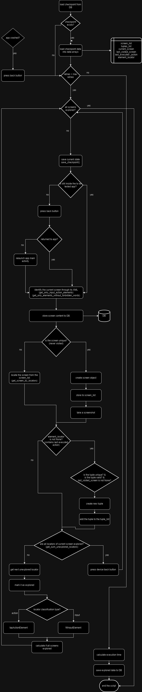

# Mobile Application Automated Traversal Script

## Project Overview

This repository contains a Python script designed for the automated traversal and analysis of mobile applications, leveraging the Appium automation tool. The primary focus is on Android applications, it is capable of intelligently identifying, classifying, and interacting with UI elements while maintaining comprehensive logging of the traversal process.

## Academic Context

This project was developed as part of the Seminar 'Automated Analysis of Mobile Health Applications' at the Westfälische Hochschule Gelsenkirchen, Department of Computer Science and Communication. The research and development were conducted under the esteemed supervision of Dr. Tobias Urban.

**Note:** The main code for this project is located on the `screen-approach` branch.

## Features

- Automated traversal of Android applications
- Element identification and classification
- Graphing the traversal as edges(screens) and edges (actions)
- Crash recovery and retry mechanism
- Logging result into SQL Database 

## Prerequisites

- Python 3.x
- Appium
- Android SDK
- Required Python packages (install via `pip install -r requirements.txt`):

## Setup

1. Clone this repository
2. Install the required packages: `pip install -r requirements.txt`
3. Set up Appium server
4. Configure your Android device or emulator

## Configuration

Modify the following variables in the script to match that of the application you want to test:

- `expected_package`: The package name of the app you want to test
- `expected_start_activity`: The main activity of the app
- `expected_target_device`: The device ID of your Android device or emulator

## Usage

Run the script using Python:
`python main_script.py`

## Key Components

- `ElementLocator`: Class for identifying and classifying UI elements
- `Screen`: Class for managing screen states
- `Tuple`: Class for managing action sequences
- `GUIApp`: Class for managing the GUI application state

## Limitations and Future Improvements

While this framework provides a robust solution for automated traversal of mobile applications, there are several areas where it could be enhanced:

1. **Cross-Platform Support**: Currently, the framework is designed for Android applications. Extending support to iOS and other mobile platforms would increase its versatility.

2. **Dynamic Content Handling**: The current implementation may face challenges with dynamically loaded content or complex, multi-step interactions. Improving the handling of such scenarios would enhance the framework's capabilities.

3. **Privacy and Security Analysis**: Incorporating more advanced privacy and security checks during the traversal process could increase the framework's utility in identifying potential vulnerabilities.

4. **AI-Enhanced Decision Making**: Incorporating machine learning algorithms could potentially improve the framework's ability to make intelligent decisions during traversal, especially in complex navigation scenarios.

5. **Expanded Element Interaction**: While the framework can interact with basic UI elements, support for more complex interactions (e.g., swipe gestures, multi-touch events) could be expanded.

6. **Deeper Static Analysis**: Integrating more comprehensive static analysis of the application code could provide additional insights and guide the dynamic traversal process more effectively.

7. **Parallel Execution**: Adding support for parallel execution across multiple devices or emulators could significantly reduce total traversal time for complex applications.

These limitations present opportunities for future work and contributions from the open-source community. We welcome suggestions and pull requests addressing these or other areas for improvement.

## Flowchart of the process of app traversal

